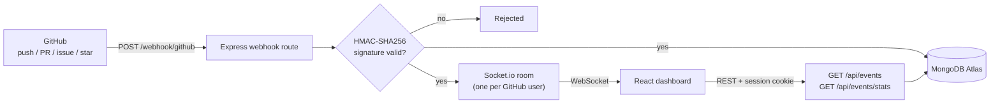

<h1 align="center">DevPulse</h1>

<p align="center">
  <b>Real-time GitHub activity dashboard.</b><br/>
  Push, open a PR, star a repo, and watch it land in your browser instantly. No polling, no refresh.
</p>

<p align="center">
  
  
  
  
  
</p>

<!-- Demo: record a 20-30s capture of a push appearing live, save as docs/demo.gif, then uncomment:
<p align="center"></p>
-->

> **Status:** not hosted. It runs locally in about five minutes, see [Run locally](#run-locally).

---

## What it does

DevPulse connects to your GitHub account with OAuth and listens to repository events through webhooks. Every event is verified, stored, and pushed to your open dashboard over WebSockets.

| | Feature | How it works |
| --- | --- | --- |
| 🔐 | **GitHub OAuth login** | Passport.js authorization-code flow, sessions stored in MongoDB |
| 🛡️ | **Verified webhooks** | HMAC-SHA256 signature check with constant-time comparison; unsigned or forged requests are rejected |
| ⚡ | **Live feed** | Socket.io with one private room per GitHub user, so events reach only their owner |
| 📊 | **Dashboard** | Commit activity by day, PR velocity, events-by-type breakdown, live event feed (Recharts) |

## Architecture



## Design decisions

- **Webhooks over polling.** Events arrive the moment they happen, with no wasted API calls and no rate-limit pressure.
- **Signature verification.** The raw request body is signed with the webhook secret and compared to the `X-Hub-Signature-256` header using `crypto.timingSafeEqual`. The webhook route is mounted before `express.json()` so the raw bytes are what gets verified.
- **Sessions over JWT.** The OAuth code flow is server-side, so a revocable session cookie is simpler and safer than tokens in the browser.
- **Rooms for isolation.** Each user joins a room named after their GitHub id; a webhook event is emitted only to that room.
- **Direct emit, no pub/sub.** The webhook handler emits straight to Socket.io. That is correct for a single server instance. Running several instances would need a shared layer (for example the Socket.io Redis adapter) so every instance can reach every client.
- **Cookie policy by environment.** In development the session cookie is `lax`; in production it becomes `secure` + `sameSite: none` for cross-domain hosting.

## API

| Method | Route | Auth | Purpose |
| --- | --- | --- | --- |
| GET | `/auth/github` | none | Start GitHub OAuth |
| GET | `/auth/github/callback` | none | OAuth callback, creates the session |
| GET | `/auth/me` | session | Current user |
| GET | `/auth/logout` | session | Destroy the session |
| POST | `/webhook/github` | HMAC signature | Receive GitHub events |
| GET | `/api/events` | session | Paginated event history |
| GET | `/api/events/stats` | session | Commits per day, PR count, events by type |

## Tech stack

| Layer | Tools |
| --- | --- |
| Frontend | React, Vite, React Router, Context API, Axios, Socket.io client, Recharts |
| Backend | Node.js, Express, Passport (GitHub OAuth), express-session + connect-mongo, Socket.io |
| Data | MongoDB Atlas with Mongoose |

## Project structure

```
devpulse/
  backend/    Express API, OAuth, webhook receiver, Socket.io
  frontend/   React dashboard
```

## Run locally

**Prerequisites:** Node.js 18+, a free MongoDB Atlas cluster, and [ngrok](https://ngrok.com) so GitHub can reach your machine.

**1. Install**

```bash
git clone https://github.com/aayushtiwari307/devpulse.git
cd devpulse/backend && npm install
cd ../frontend && npm install
```

**2. Create a GitHub OAuth App** at github.com/settings/developers:

- Homepage URL: `http://localhost:5173`
- Authorization callback URL: `http://localhost:5000/auth/github/callback`

**3. Configure the backend.** Copy `backend/.env.example` to `backend/.env`:

| Variable | Purpose |
| --- | --- |
| `MONGO_URI` | MongoDB connection string |
| `GITHUB_CLIENT_ID`, `GITHUB_CLIENT_SECRET` | From your OAuth App |
| `GITHUB_CALLBACK_URL` | `http://localhost:5000/auth/github/callback` |
| `SESSION_SECRET` | Long random string |
| `WEBHOOK_SECRET` | Any random string; reuse it when creating the webhook |
| `PORT` | `5000` |
| `CLIENT_URL` | `http://localhost:5173` |
| `NODE_ENV` | `development` (use `production` only when frontend and backend are on different domains) |

**4. Configure the frontend.** Create `frontend/.env`:

```
VITE_API_URL=http://localhost:5000
```

**5. Start both servers** in two terminals:

```bash
cd backend && npm run dev
cd frontend && npm run dev
```

Open `http://localhost:5173` and sign in with GitHub.

**6. Send live events.** Run `ngrok http 5000`, then in any repo you own go to *Settings > Webhooks > Add webhook*:

- Payload URL: `https://<your-ngrok-host>/webhook/github`
- Content type: `application/json`
- Secret: the same value as `WEBHOOK_SECRET`
- Events: pushes, pull requests, issues, stars

Push a commit and it appears in the live feed.

<details>
<summary><b>Troubleshooting</b></summary>

- **Webhook shows red / 401 in GitHub:** the secret in the webhook does not match `WEBHOOK_SECRET`, or the content type is not `application/json`.
- **Events stop arriving after a restart:** the free ngrok URL changes every time; update the webhook's Payload URL.
- **Login loops back to the login page:** check that `CLIENT_URL` matches the exact origin you opened and that `GITHUB_CALLBACK_URL` matches the OAuth App setting.
- **Cookie not sticking on localhost:** keep `NODE_ENV=development` (production mode requires HTTPS).

</details>

## Security notes

- `.env` files are gitignored; never commit them.
- Webhook requests without a valid signature are rejected before any data is stored.
- Session cookies are `httpOnly`; in production they are also `secure`.

## Author

**Aayush Tiwari** - [GitHub](https://github.com/aayushtiwari307)
